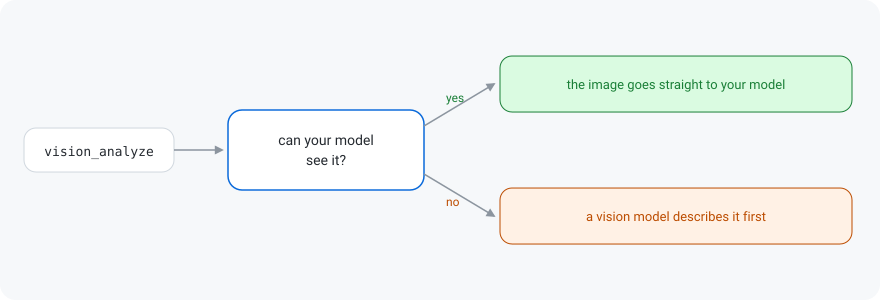

# hermes-vision-inline

A Hermes plugin that lets your model look at images and video itself, instead of getting a written description from the auxiliary model.

Keeping the image inline preserves the full context, supports follow-up questions without reprocessing, allows the model to inspect relevant details directly, and avoids the added complexity of a separate captioning model. It is generally much faster and more accurate and easier to work with.

For images this is a restoration. Native routing shipped as the fix for [issue #29135](https://github.com/NousResearch/hermes-agent/issues/29135), then [PR #97339](https://github.com/NousResearch/hermes-agent/pull/97339) reversed it.



## Install

Linux and macOS:

```bash
git clone https://github.com/BrokeSkill/hermes-vision-inline
cd hermes-vision-inline
./install.sh
```

Windows, from PowerShell in a clone:

```powershell
git clone https://github.com/BrokeSkill/hermes-vision-inline
cd hermes-vision-inline
.\install.ps1
```

The script copies the plugin to `~/.hermes/plugins/hermes-vision-inline` and
enables it. By hand, the same two steps:

```bash
hermes plugins enable hermes-vision-inline
systemctl --user restart hermes-dashboard.service
```

The desktop backend caches its plugin list per process, so a restart is *needed*.

## Usage

When the Model chooses either _vision_analyze_ or _video_analyze_, it stops the call, looks up the session model, and
picks a path:

| catalog says | path taken |
| --- | --- |
| model accepts images | `_vision_analyze_native` runs; the image is encoded into the tool result as an `image_url` part |
| model accepts video | the video is materialized, base64 encoded, and attached as a `video_url` part |
| model does not, or is not listed | `vision_analyze_tool` / `video_analyze_tool` runs; the auxiliary vision model returns `{"success": true, "analysis": "..."}` |

## How the model is identified

The decision of if a Model is Vision/Video capable comes from the models.dev catalog Hermes keeps on disk
(`~/.hermes/models_dev_cache.json`, 8000+ models, refreshed by Hermes).

## Install without a plugin loader

The plugin is two files. Copy `__init__.py` and `plugin.yaml` into
`~/.hermes/plugins/hermes-vision-inline/` and the loader picks them up; there
are no dependencies to resolve and nothing to configure.

## Uninstall

```bash
hermes plugins disable hermes-vision-inline
```

## License

MIT. See [LICENSE](LICENSE).
